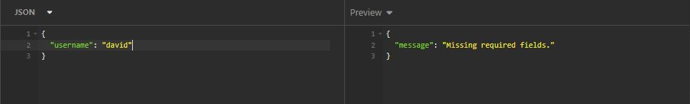
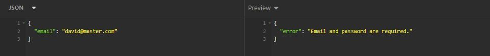
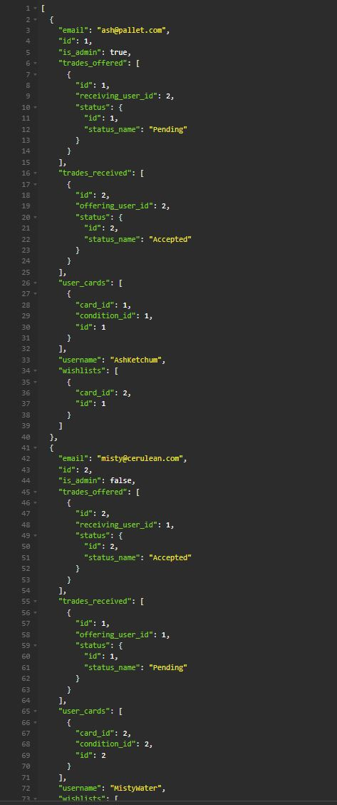
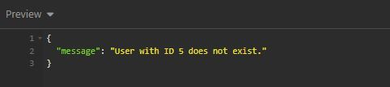
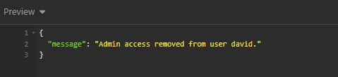
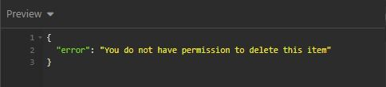
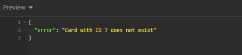

# VAN NGUYEN T2A2-API-WebServer

## Pokemon TCG (Trading Card Game) Tracker/Trader

### GitHub Repository
https://github.com/montsieur/T2A2-API-Application

### Installation Guide

*Note: run on local port is 8080.*

1. Ensure PostgreSQL database server is running through terminal. Enter the following:
    
    - Linux

            sudo service postgresql start

    - Mac

            brew service postgresql start

2. In terminal once postgresql is running, enter:

        sudo -u postgres psql

    Note: if you have troubles starting postgresql, run this code:

        sudo service postgresql start

3. Create database pokemontcg_tracker

        CREATE DATABASE pokemontcg_tracker;

4. Connect to the database

        \c pokemontcg_tracker

5. Create a new user for the database

        CREATE USER username WITH PASSWORD 'password';

6. Grant priviledges to the user profile you just created

        GRANT ALL PRIVILEGES ON DATABASE pokemontcg_tracker TO username;

7. Exit postgresql

        \q

8. Set up virtual environment in working directory

        python3 -m venv .venv

9. Activate virtual environment

        source .venv/bin/activate

10. install all dependencies using the following requirement.txt

        python3 -m pip install -r requirements.txt

11. Run flask db commands to create, seed and run

    - create database tables

            flask db create_db
    
    - populate seed data

            flask db seed_db

    - run API flask

            flask run

    Note: if you require to drop your existing table for any reason, use:

            flask db drop_db

### R1: Explain the problem that this app will solve, and explain how this app solves or addresses the problem.

The **Pokémon TCG Tracker** addresses a common problem faced by many collectors and players of the Pokémon Trading Card Game community; organizing and tracking their card collections. With so many cards released globally since 1998, many collectors struggle to keep track of which cards they own, the conditions of these cards, and which cards they are still looking for. This can lead to duplicate purchases, missed opportunities to complete sets, and difficulties in trading with other collectors.

This API solves this problem by providing a comprehensive platform for managing collections. Users can create an inventory of their cards, specifying details such as card condition, rarity, and set. This helps them stay organized and make informed decisions when purchasing or trading cards. Additionally, the app offers wish list and trading features that allow users to specify which cards they want or are willing to trade. This facilitates better trades between users, minimizing the risk of unfair exchanges and maximizing opportunities to complete collections.

### R2: Describe the way tasks are allocated and tracked in your project.

Project planning was done using **Trello** which was seperated into four different cards; *To do, Doing, Testing and Done*. Through step by step planning from listing tasks required to complete this application, it was further broken down to ensure all components of the project was covered. Below is an example of my initial plan.

The tracking progress was done through completing each task one by one, test it (when relevant) and once it is green lit, it is moved to done.

#### Milestone 1

To start the project, it was required to create an ERD (Entity Relationship Diagram) to layout the structure of the database. Alongside, I created the project plan on Trello to create tasks, plan my project structure and document the project through a README.md.

#### Milestone 2

After planning was complete, I moved to building the initialization which includes the main, init and environment files required for this project. In addition, to complete each model based on the approved ERD and marking it off one by one as each model was completed.

#### Milestone 3

Once models were completed, it was to build the controllers for each model to control and build the database which includes creating CLI commands, Routes and implementing validation/serialization.

#### Milestone 4

Before going through testing, even though I had commented portions of code whilst building each component of the project, I went through to ensure comments were placed to track my progress and also allow me determine what I have done.

#### Milestone 5

With both models and controllers built, I moved to testing each controller on Insomnia to ensure each endpoint is valid and working. In addition to testing flask commands in PostgreSQL to create, drop and seed my tables in the database. There was a lot of debugging but I ensured testing of each component and documenting them in the README.md.

#### Milestone 6

On top of testing/debugging, I went back to ensure error handling was implemented thoroughly and gracefully with the use of sqlalchemy.exc, including errors such as IntegrityError and OperationError, and ensuring each route has an error message (404, 500, etc). At the same time, I moved Models and Controllers task into the testing phase ready to test and tick off for clearance.

#### Milestone 7

After all is working and completed, it is compiled and documented to be ready for submission.

### R3: List and explain the third-party services, packages and dependencies used in this app.

In this API, there are various third-party services, packages, and dependencies are used to ensure proper functionality and efficient performance. Collectively, the dependencies listed below provides core functionalities required for managing the database, handling requests, authenticating users and providing secure endpoints resulting in the application being robust and scalable.

- **Flask**: A lightweight Python web framework used for developing the API endpoints for the application. It provides essential features for routing, request handling, and session management.

- **Flask-JWT-Extended**: This package is used for implementing JSON Web Tokens (JWTs), enabling secure authentication and authorization mechanisms for users, including role-based permissions such as admin privliedges.

- **Flask-SQLAlchemy**: An ORM (Object Relational Mapper) used to interact with the PostgreSQL database. It allows developers to manipulate the database using Python objects instead of writing raw SQL queries.

- **Marshmallow**: These libraries are used for serialization and deserialization of data, helping in converting complex objects like database models into JSON format. They also provide validation mechanisms for request data. This also applys to **Flask Marshmallow**.

- **PostgreSQL**: The underlying database system used for storing user data, card details, trades, etc. It is a powerful and open-source relational database known for its reliability and scalability.

- **Psycopg2**: A PostgreSQL adapter for Python that is used in conjunction with SQLAlchemy to manage the database connection and execute SQL commands.

- **Bcrypt**: Used for hashing user passwords to ensure that sensitive information, such as passwords and is stored securely into the database.

- **Click**: A package used to create command-line commands for administrative tasks such as creating or dropping database tables and seeding data. This helps automate tasks like setting up the database.

- **SQLAlchemy-Exc**: Error handling using SQLAlchemy exceptions is implemented to provide better feedback when database operations fail. This includes handling errors such as IntegrityError for duplicate entries and OperationalError for database connectivity issues.

### R4: Explain the benefits and drawbacks of this app’s underlying database system.

The application uses **PostgreSQL** as its underlying database system. The features of PostgreSQL is an advantages database systems to create a trading card tracking application as it offers data integrity and scalability but can be complicated to setup and maintain during development. Here are its benefits and drawbacks:

#### Benefits:

- **Reliability and ACID Compliance**: This ensures data consistency and integrity, which is critical for secure trading and tracking of Pokémon cards.
- **Scalability**: The database can handle large volumes of data, allowing the app to grow as more cards, users, and trades are added.
- **Extensibility**: It supports custom data types and functions, which is beneficial for storing specific card attributes.
- **Open-Source**: Being open-source, there is no cost requirement to development this application.

#### Drawbacks:

- **Configuration**: For beginners, the learning curve can be quite steep when setting up and maintaining PostgreSQL as it may require more technical expertise.
- **Performance**: Compared to some other lightweight databases, PostgreSQL may consume more system resources, which could affect performance on limited hardware.
- **Limited Built-in Horizontal Scaling**: PostgreSQL does not inherently support distributed databases for horizontal scaling, which could limit scalability for high-traffic applications without additional setup.

### R5: Explain the features, purpose and functionalities of the object-relational mapping system (ORM) used in this app.

The application uses **SQLAlchemy** as its **Object-Relational Mapping (ORM)** system. The purpose of an ORM is to bridge the gap between relational databases and object-oriented programming, making it easier for developers to interact with databases using Python objects instead of raw SQL queries. Here are the features, purpose, and functionalities of SQLAlchemy as used in this app:

Features and Functionalities:
1. **Object Representation of Database Tables**: Database tables are represented as Python classes, and rows are instances of these classes. This makes interacting with the database more intuitive for developers familiar with Python.
 

        class User(db.Model):
            __tablename__ = 'users'
            id = db.Column(db.Integer, primary_key=True)
            username = db.Column(db.String(100), unique=True, nullable=False)
            email = db.Column(db.String(255), unique=True, nullable=False)

    In the model example above, the User class maps to the users table and shows variables such as id, username and email along with it's attributes, allowing you to easily maintain creation and manipulation of users.
 

2. **Query Building**: Provides an API to create queries, enabling complex queries without writing SQL directly. It simplifies fetching records and filtering based on conditions.
 

        user = User.query.filter_by(username='AshKetchum').first()

    This code retrieves the user with the username "*AshKetchum*" without writing an SQL query explicitly.
 

3. **Relationship Management**: It supports relationships between tables, making it easy to define foreign keys and access related data. For example, each user can have multiple cards using a one-to-many relationship.
 

        cards = db.relationship('UserCard', back_populates='user')

With relationships, it becomes simple to query related data, like fetching all cards belonging to a specific user. The code above shows the relationship that links the ``UserCard model`` and  ``User model``, meaning for each ``UserCard``,it also has ``user`` attributes that points back to it's associated user (``back_populate``).
 

4. **Data Validation and Serialization**: Using Marshmallow with SQLAlchemy, the app can validate and serialize data easily. Marshmallow schemas are used to convert database objects to JSON format, making it convenient to send data to and from the application.
 

        class UserSchema(ma.Schema):
            id = fields.Int()
            username = fields.Str(required=True)
            email = fields.Str()

 

**SQLAlchemy**, combined with **Marshmallow** for serialization, provides a robust ORM system that simplifies database operations through Python classes and functions which assists developers due to the familiarity of Python. It manages relationships, helps in efficient querying, and provides a means of maintaining the interface for schema management. This makes the app’s code more readable, maintainable, and efficient while handling interactions with the underlying PostgreSQL database.

### R6: Design an entity relationship diagram (ERD) for this app’s database, and explain how the relations between the diagrammed models will aid the database design. 

#### Entities:

- **User**: Stores user information like username, email, password hash, and admin status.
- **Card**: Represents a trading card, including its name, card type, rarity, and set.
- **Set**: Represents a card set, including its name and release date.
- **Rarity**: Defines the rarity levels of cards, such as Common or Rare.
- **Condition**: Defines the condition of cards, such as Mint or Near Mint.
- **Wishlist**: Represents cards that a user wants, storing the user ID and card ID.
- **UserCard**: Represents cards owned by users, storing user, card, and condition information.
- **Trade**: Represents a trading offer between two users, including offering and receiving card details.
- **Status**: Defines trade status (e.g., Pending, Accepted, Declined).

#### Relationships:

- **User** has one-to-many relationships with **UserCard**, **Wishlist**, and **Trade** (as offering and receiving users).
- **Card** is related to **UserCard**, **Wishlist**, and **Trade**.
- **Set** has a one-to-many relationship with **Card**.
- **Rarity** and **Condition** have one-to-many relationships with **Card** and **UserCard**.
- **Trade** is linked to **Status**, indicating the current state of a trade.

#### How does it aid database design?

By linking ``users`` to ``cards`` through the ``UserCard`` and ``Wishlist`` entities, it creates a ``User-Card`` Relationship that allows for efficient tracking of user collections and desired cards. In addition, it's ``Trade`` relationship links ``users`` and ``cards`` to manage trades. This is contributed through the ``Status`` attribute to ensure it is tracked accurately.

#### Normalization and Level Comparison:

- **First Normal Form (1NF)**: All attributes have atomic values with each table containing no repeating groups.
- **Second Normal Form (2NF)**: Each non-key attribute is dependent on a primary key. For example, ``UserCard`` includes ``user ID``, ``card ID``, and ``condition ID``, which are dependent on the composite key ``user`` and ``card``.
- **Third Normal Form (3NF)**: There are no non-key attributes that are dependant on other non-key attributes as each table stores attributes related only to the entity it represents. For example ``Card`` details are separated from ``UserCard``, avoiding redundancy.

For its comparisons between levels, in **1NF**, a single User table might contain all information, including cards and trades, resulting in redundancy and potential update anomalies. Compared to the **3NF** design shown, separating each table like ``Card``, ``Trade`` and ``Wishlist``, it removes redundant data to reduce the risk of inconsistencies and improving data integrity.

### R7: Explain the implemented models and their relationships, including how the relationships aid the database implementation.

#### Overview:

- **User**: Represents users of the app. Fields include id, username, email, password_hash, and is_admin.
- **Card**: Represents trading cards. Fields include id, name, card_type, rarity_id, set_id.
- **Set**: Represents card sets, including fields like set_name and release_date.
- **Rarity**: Defines the rarity levels of cards, with fields like rarity_name.
- **Condition**: Represents card conditions, with fields like condition_name.
- **Wishlist**: Links users and their desired cards, including user_id and card_id.
- **UserCard**: Links users and cards they own, including user_id, card_id, and condition_id.
- **Trade**: Represents trading activity between users. Fields include offering_user_id, receiving_user_id, offering_card_id, receiving_card_id, and status_id.
- **Status**: Represents the status of trades, such as Pending, Accepted, etc.

#### Relationships:

1. **User and UserCard (One-to-Many)**: A user can own multiple cards.
    Query: ``User.query.get(user_id).user_cards`` can be used to get all cards owned by a user.
 

        user = User.query.get(user_id)
        user_cards = user.user_cards  # Get all UserCard records for the user

2. **User and Wishlist (One-to-Many)**: A user can have multiple cards in their wishlist. 

    Query: ``User.query.get(user_id).wishlists`` retrieves all wishlist items of a user.
 

        user = User.query.get(user_id)
        wishlist_items = user.wishlists  # Get all wishlist items for the user

3. **User and Trade (One-to-Many)**: A user can offer multiple trades (trades_offered) and receive multiple (trades_received).

    Query: ``User.query.get(user_id).trades_offered`` retrieves all trades where a user is involved as an offering user.
 

            user = User.query.get(user_id)
            offered_trades = user.trades_offered  # Get trades offered by the user
            received_trades = user.trades_received  # Get trades received by the user

4. **Card and Trade (One-to-Many)**: Each card can be part of multiple trades (either being offered or received).

    Query: ``Card.query.get(card_id).trades_offered`` can be used to retrieve all trades where the card is being offered.
 

        card = Card.query.get(card_id)
        trades_offered = card.trades_offered  # Get all trades in which the card is offered

5. **Card and Rarity, Set (Many-to-One)**: A card belongs to a specific rarity and set.

    Query: ``Card.query.get(card_id).set`` provides the set the card belongs to.
 

        card = Card.query.get(card_id)
        card_set = card.set  # Get the set details of the card

6. **Trade and Status (Many-to-One)**: A trade has a status, which is represented by the Status model.

    Query: ``Trade.query.get(trade_id).status`` gives the current status of the trade.
 

        trade = Trade.query.get(trade_id)
        trade_status = trade.status  # Get the status of the trade

#### How does relationships aid database design?

The relationships between models allow querying and gathering data more efficient. For example, the ability to access a user's trade, cards, and/or wishlist with a relationship query allows for building dynamic features such as viewing a user's profile, trade history or their card collection. In addition, Foreign Keys ensures data integrity between its related tables to prevent orphaned data and allow data management to be easier, shown by the code examples above through queries.

### R8: Explain how to use this application’s API endpoints. Each endpoint should be explained, including the following data for each endpoint:

- HTTP verb
- Path or route
- Any required body or header data
- Response

#### AUTH

1. ***/auth/register*** - to register a user

- **HTTP method**: ``POST``
- **Required Body**:

- **Response**:

When Successful:

    
Error Occurs: 

- Already existing user:

- Missing fields in either username, email and/or password

2. ***/auth/login*** - user login

- **HTTP method**: ``POST``
- **Required Body**:

- **Response**:

When Successful:

Error Occurs:

- When email and/or password is invalid

- When email and/or password is missing from field

#### USER

1. ***/users/*** - get all users (admin only)

- **HTTP method**: GET
- **Required Body**: none
- **Response**:

When Successful:

2. ***/users/<user_id>***

- Get Specific User ID

    - **HTTP method**: GET
    - **Required Body**: none
    - **Response**:

When Successful:

- Displays user information including their current trades

Error Occurs:

- When user id does not exist.

- Update User 

    - **HTTP method**: PUT/PATCH
    - **Required Body**: Variables such as name, password and/or email.
    - **Response**:

When Successful:

Error Occurs:

- When user id request does not match database

- When email is already in use/existing

- Delete User (admin Only)

    - **HTTP method**: DELETE
    - **Required Body**: none
    - **Response**:

When Successful:

Error Occurs:

- When user id cannot be found in database

3. ***/users/<user_id>/grant-admin*** - grants admin priviledges to user (admin only)

- **HTTP method**: PUT
- **Required Body**: none
- **Response**: 

When Successful:

Error Occurs:

- When user is already an admin

- When user id cannot be found in database

4. ***/users/<user_id>/remove-admin*** - revokes admin priviledges from a user (admin only)

- **HTTP method**: PUT
- **Required Body**: none
- **Response**:

When Successful:

Error Occurs:

- When existing user is already not an admin

- When user id cannot be found in database

#### USER CARD

1. ***/user-cards/*** - gets cards from all current user

- **HTTP method**: GET
- **Required Body**: none
- **Response**:

2. ***/user-cards/<user_id>*** - gets cards from specific user

- **HTTP method**: GET
- **Required Body**: none
- **Response**:

3. ***/user-cards/<id>*** - user card id

- Add card to user's collection

    - **HTTP method**: POST
    - **Required Body**:

        

    - **Response**:

        

- Update user's card existing in their collection

    - **HTTP method**: PUT/PATCH
    - **Required Body**: attributes user would like to update such as condition, rarity, etc.
    - **Response**:

When successful:

Error occurs:

- When user_card_id does not exist in user's collection

- When user's JWT does not match with database when comparing data (jwt and user_card_id)

- Delete user's card from collection

    - **HTTP method**: DELETE
    - **Required Body**: none
    - **Response**:

When successful:

Error occurs:

- When user's JWT does not match with database when comparing data (jwt and user_card_id)

#### CARD

1. ***/card/***

- Display all existing cards in database
    - **HTTP method**: GET
    - **Required Body**: none
    - **Response**:

- Add new card to database
    - **HTTP method**: POST
    - **Required Body**:
        
    - **Response**:
           

2. ***/card/<card_id>***

- Get specific card ID
    - **HTTP method**: GET
    - **Required Body**: none
    - **Response**:

        - When succesful:

            

        - Error occurs:
            - When card_id does not exist in database
            

- Update existing card from database
    - **HTTP method**: PUT/PATCH
    - **Required Body**:
        
    - **Response**:

        - When successful:
        

        - Error occurs:
            - When card_id does not exist in database
        

- Delete card from database
    - **HTTP method**: DELETE
    - **Required Body**: none
    - **Response**:
        - When successful:
        
        - Error occurs:
            - When card_id does not exist in database
            

#### RARITY

1. ***/rarities/***

- Get list of all rarities in database
    - **HTTP method**: GET
    - **Required Body**: none
    - **Response**:
        

- Add a new rarity into database (admin only)
    - **HTTP method**: POST
    - **Required Body**:
        
    - **Response**:
        

2. ***/rarities/<rarity_id>***

- Get a specific rarity_id 
    - **HTTP method**: GET
    - **Required Body**: none
    - **Response**:
        If successful:
        
        
        Error occurs:
            - When rarity_id does not exist in database
            

- Delete an existing rarity_id  (admin only)
    - **HTTP method**: DELETE
    - **Required Body**: none
    - **Response**: 
        If successful:
        
        
        Error occurs:
            - When rarity_id does not exist in database
            

#### SET

1. ***/set/***

- Get list of all sets in database
    - **HTTP method**: GET
    - **Required Body**: none
    - **Response**:
        

- Add a new set into database (admin only)
    - **HTTP method**: POST
    - **Required Body**:
        
    - **Response**:
        - If successful:
            
        - Error occurs:
            - When invalid date entry due to entered in wrong format
            
2. ***/sets/<set_id>***

- Get a specific set_id from database (shows set details and cards in the set)
    - **HTTP method**: GET
    - **Required Body**: none
    - **Response**:
        - If successful:
        
        - Error occurs:
            - When set_id does not exist in database
            

- Update an existing set_id (admin only)
    - **HTTP method**: PUT/PATCH
    - **Required Body**:
        
    - **Response**:
        - If successful:
            
        - Error occurs:
            

- Delete an existing set_id (admin only)
    - **HTTP method**: DELETE
    - **Required Body**: none
    - **Response**:
        - If successful:
            
        - Error occurs
            - When set_id does not exist in database
                

#### CONDITION

1. ***/conditions/***

- Get list of all condition types in database
    - **HTTP method**: GET
    - **Required Body**: none
    - **Response**:
        
- Add a new type of condition into database (admin only)
    - **HTTP method**: POST
    - **Required Body**:
        
    - **Response**:
        

2. ***/conditions/<condition_id>*** - delete an existing condition from database (admin only)
- **HTTP method**: DELETE
- **Required Body**: none
- **Response**:
    - If successful:
        
    - Error occurs:
        
#### WISHLIST

1. ***/wishlists/***

- Get all existing wishlist in database (admin only)
    - **HTTP method**: GET
    - **Required Body**: none
    - **Response**:
        
- Add a new card into database 
    - **HTTP method**: POST
    - **Required Body**:
        
    - **Response**:
            

2. ***/wishlists/<wishlist_id>***

- Get specific wishlist_id from database
    - **HTTP method**: GET
    - **Required Body**: none
    - **Response**:
        

- Remove card from wishlist
    - **HTTP method**: DELETE
    - **Required Body**: none
    - **Response**:
        - If successful:
            
        - Error occurs:
            - If wishlist_id does not exist in database
                
            - When jwt token does not match (if they are not the same user as wishlist owner or have admin access)
                

#### TRADING

1. ***/trades/***

- Get all existing trades in database (admin only)
    - **HTTP method**: GET
    - **Required Body**: none
    - **Response**:
        
- Create a new trade offer
    - **HTTP method**: POST
    - **Required Body**:
        
    - **Response**:
        - If successful:
            
        - Error occurs:
            - When receiving_id does not exist in database
            
            - When card_id of trade does not exist in database
            
            - When quantity of offering/receiving card is 0 or invalid (must be greater than 0, INT)
            
            
2. ***/trades/<trade_id>***

- Get detail of a specific trade_id
    - **HTTP method**: GET
    - **Required Body**: none
    - **Response**:
        - If successful:
            
        - Error occurs:
            - When trade_id does not exist in database
                
- Update trade status 
    - **HTTP method**: PUT/PATCH
    - **Required Body**:
        
    - **Response**:
        - If successful:
        
        - Error occurs:
        

- Delete existing trade (admin only)
    - **HTTP method**: GET
    - **Required Body**: none
    - **Response**:
        - If successful:
        
        - Error occurs:
            - When trade_id does not exist in database
            
#### STATUS

1. ***/statuses/***

- Get list of all statuses in database
    - **HTTP method**: GET
    - **Required Body**: none
    - **Response**: 
    

- Add a new status_id into database (admin only)
    - **HTTP method**: POST
    - **Required Body**:
        
    - **Response**:
        - If successful:
            
        - Error occurs:
            - When name of status already exist
                

2. ***/statuses/<status_id>***

- Get a specific status_id in database
    - **HTTP method**: GET
    - **Required Body**: none
    - **Response**:
        - If successful:
            
        - Error occurs:
            - When status_id does not exist
                

- Delete an existing status_id in database (admin only)
    - **HTTP method**: DELETE
    - **Required Body**: none
    - **Response**: 
        - If successful:
            
        - Error occurs:
            - When status_id does not exist in database
                

